# ZKredit System Architecture & Design

This document outlines the complete technical architecture of the ZKredit protocol.

## 1. High-Level System Architecture

The following diagram illustrates the entire ZKredit ecosystem, highlighting the separation of concerns between **Client-Side Privacy**, **Trusted Off-Chain Data**, and **On-Chain Verification**.

```mermaid
graph TD
    %% Subgraphs for Logical Boundaries
    
    subgraph Client_Device ["📱 Client Device (User's Browser)"]
        style Client_Device fill:#f9f9f9,stroke:#333,stroke-width:2px
        
        UI["⚛️ React UI (Vite)"]
        ML_Engine["🧠 ONNX Runtime (WASM)"]
        ZK_Prover["🔐 EZKL Prover (WASM)"]
        
        UI -->|"1. Financial Data"| ML_Engine
        UI -->|"2. Score + Data"| ZK_Prover
        ML_Engine -->|"3. Score"| UI
        ZK_Prover -->|"4. Proof"| UI
    end

    subgraph Trusted_Source ["🏦 Trusted Data Issuer"]
        style Trusted_Source fill:#fff7ed,stroke:#f97316,stroke-width:2px
        
        BankAPI["🖥️ Bank API (Node.js)"]
        Signer["📝 ECDSA Signer"]
        DB[("🗄️ User Database")]
        
        BankAPI <--> DB
        BankAPI <--> Signer
    end

    subgraph Blockchain ["🌐 Base Sepolia (L2)"]
        style Blockchain fill:#eff6ff,stroke:#3b82f6,stroke-width:2px
        
        LendingPool["💎 ZKreditLendingPool.sol"]
        Verifier["⚖️ Verifier.sol (Halo2)"]
        Registry_C["📋 ConstraintRegistry"]
        Registry_M["📦 ModelRegistry"]
        Registry_S["🛡️ SecurityRegistry"]
        
        LendingPool -->|"Verify Proof"| Verifier
        LendingPool -->|"Check Rules"| Registry_C
        LendingPool -->|"Check Model"| Registry_M
        LendingPool -->|"Log Attacks"| Registry_S
    end

    %% Interactions
    UI <-->|"HTTPS (JSON + Sig)"| BankAPI
    UI <-->|"JSON-RPC (Tx)"| LendingPool

    %% Styling
    classDef contract fill:#dbeafe,stroke:#2563eb;
    class LendingPool,Verifier,Registry_C,Registry_M,Registry_S contract;
```

---

## 2. End-to-End Sequence Diagram

This sequence diagram details the exact step-by-step flow of a loan application, from data fetching to smart contract settlement.

```mermaid
sequenceDiagram
    autonumber
    actor Alice as 👩 Alice (Borrower)
    participant Client as 💻 Client (React/Wasm)
    participant Bank as 🏦 Bank API
    participant Chain as ⛓️ Smart Contracts

    Note over Alice, Chain: 1. DATA ACQUISITION & PROVENANCE
    Alice->>Client: Click "Get Loan"
    Client->>Bank: GET /api/financial-data
    Bank->>Bank: Fetch Income/Debt
    Bank->>Bank: Sign Hash(Data) with PrivateKey
    Bank-->>Client: Return {Data, Signature}
    Client->>Client: Verify Signature (Client-Side Check)

    Note over Alice, Chain: 2. PRIVACY-PRESERVING COMPUTATION
    Client->>Client: Run ONNX Model (Inputs: Income, RecentDebt...)
    Client->>Client: Output: CreditScore (e.g., 85)
    Client->>Client: Generate Witness (Private Inputs)

    Note over Alice, Chain: 3. ZK PROOF GENERATION
    Client->>Client: EZKL Prove (Witness, Model, PK)
    Client-->>Client: Generate ZK-SNARK Proof

    Note over Alice, Chain: 4. ON-CHAIN SETTLEMENT
    Client->>Chain: requestLoan(Proof, PublicSignals, Collateral)
    
    rect rgb(240, 248, 255)
        Note right of Chain: 🛡️ 5-LAYER VERIFICATION
        Chain->>Chain: Layer 0: Check Proof Not Used (Anti-Replay)
        Chain->>Chain: Layer 1: Check Income > Min & DTI < Max
        Chain->>Chain: Layer 2: Verify Bank Signature (Provenance)
        Chain->>Chain: Layer 3: Verify ZK Proof (Integrity)
        Chain->>Chain: Layer 4: Validate Score Range (0-100)
        Chain->>Chain: Layer 5: Validate Model Hash (Tamper check)
    end
    
    alt Verification Success
        Chain->>Alice: Transfer Loan Amount (0.5 ETH)
        Chain->>Chain: Emit LoanApproved Event
        Client->>Alice: Display "Loan Approved! 🎉"
    else Verification Failure
        Chain-->>Client: Revert Transaction (e.g., "Constraint Violation")
        Chain->>Chain: Slash Security Deposit (if attack)
        Client->>Alice: Display error details 🚨
    end
```

---

## 3. Component Details & Interactions

### 3.1 Bank API (Mock Oracle)
*   **Role**: Acts as the "Issuer".
*   **Trust Model**: The Smart Contract trusts the Bank's Public Key (stored on-chain or verified via signature recovery).
*   **Key Function**: `sign(keccak256(income, debt, score))` -> `(v, r, s)`.

### 3.2 ML Pipeline (Client-Side)
*   **Role**: Acts as the "Evaluator".
*   **Technology**: ONNX Runtime via WebAssembly.
*   **Input**: Private User Data.
*   **Output**: Public Credit Score.
*   **Privacy**: Inputs never leave the browser.

### 3.3 ZK System (EZKL)
*   **Role**: Acts as the "Prover".
*   **Circuit**: Defines the validity of the ML execution.
*   **Public Signals**: `[Income, DTI, ModelHash]` (These are revealed to the chain to enforce constraints).
*   **Private Inputs**: `[Granular Credit History, Missed Payments, etc.]` (Hidden).

### 3.4 Smart Contracts (Base Sepolia)
*   **Role**: Acts as the "Verifier" and "Settlement Layer".
*   **Contract**: `ZKreditLendingPool.sol`.
*   **Logic**:
    *   **ConstraintRegistry**: Stores dynamic rules (e.g., Min Income changed to $35k).
    *   **ModelRegistry**: Stores the hash of the "valid" ML model (`0xABC...`).
    *   **SecurityRegistry**: Logs failed attempts for analysis.

## 4. Security Model: The "Constraint Sandwich"

This architecture implements a defense-in-depth strategy:

1.  **Hard Constraints (Bread)**: Even if the ZK proof is spoofed, the contract checks `Income > Threshold` explicitly on public signals.
2.  **ZK Verification (Meat)**: Cryptographically proves the Score was derived correctly from Hidden Data.
3.  **Data Provenance (Bread)**: Ensures the Hidden Data (Witness) matches the Public Signals attested by the Bank.

This ensures that an attacker cannot:
*   Use fake data (Fails Layer 2).
*   Use a fake model (Fails Layer 5).
*   Use a fake score (Fails Layer 3).
*   Submit a score that violates risk policies (Fails Layer 1).
